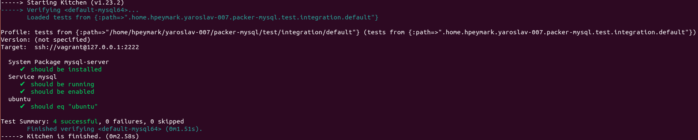

# kitchen-travis test
Kitchen-vagrant test that checks the vagrant virtualbox box have redis

## pre-requirements

all pre-requirementa to make this work here:
- Linux OS Ubuntu 18.04
- Install **Vagrant** 
	- Download Vagrant from https://www.vagrantup.com/downloads.html
	- Extract the binary file and move/copy it to /usr/local/bin/
	- Check if installed 
		``` vagrant -v ```
- Install **Ruby environment**
	- Execute in terminal: ```sudo apt-get install rbenv ruby-dev ruby-bundler```
	- add the following to your ~/.bash_profile:
			```
			eval "$(rbenv init -)"
			true
			export PATH="$HOME/.rbenv/bin:$PATH"
			```
- Install **Packer**
	- Download Vagrant from https://www.packer.io/downloads.html
	- Extract the binary file and move/copy it to /usr/local/bin/
	- Check if installed 
		``` packer -v ```
 - Install **Virtualbox**
	 - Execute in terminal: ```sudo apt-get install virtualbox```

## How to run the code
In the terminal run the following commands:
	
	packer build template.json
	vagrant box add --name mysql64 --provider virtualbox vagrant box ubuntu-1604-vbox.box
	kitchen init
	kitchen list
	kitchen converge
	kitchen verify
	kitchen destroy

